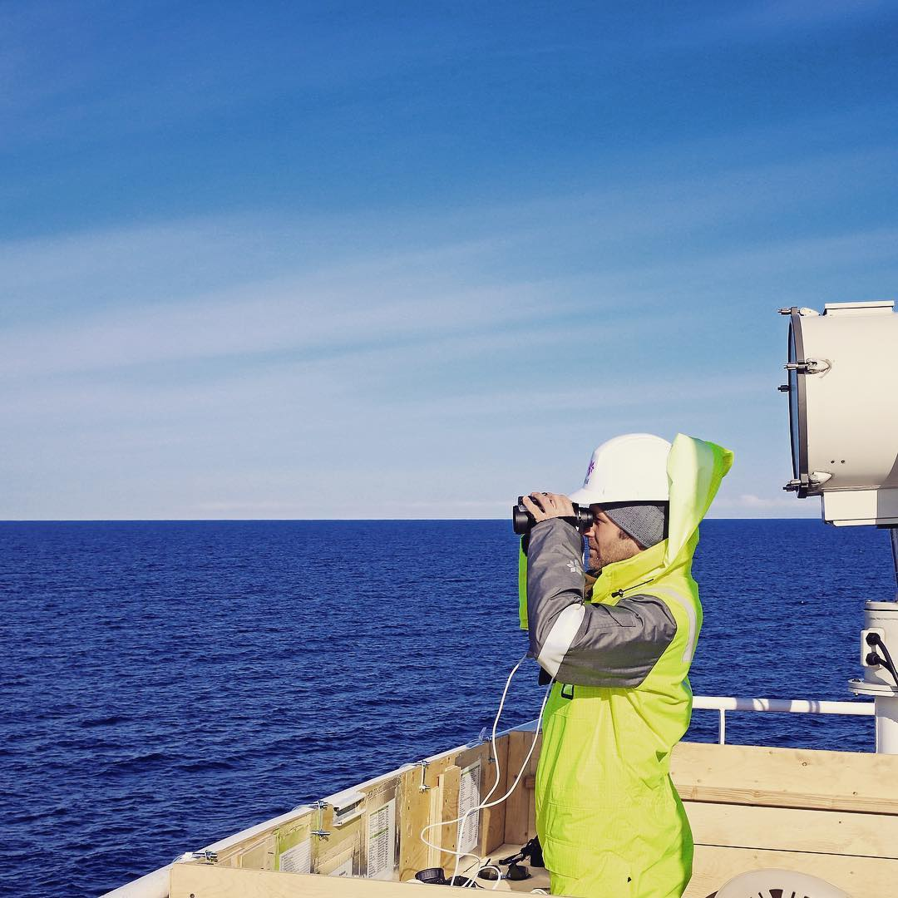

# Marine Mammal Observatory

The MMO Durimeter (_Marine Mammal Observatory Tool_) is a very cost-effective and sweet tool for observing and record detailed information for each observation.

### Introduction

Read the [Introduction](docs/introduction.md) page.

### Developers

Read the [Developer](docs/for_developers.md) page.

## Device in action

# Credits

_Project_:
- Jürgen Weissenberger <jurw@statoil.com>
- Tom McKeever <thmc@statoil.com>

_Development:_
- Arve Skogvold <arve@skogvold.org>
- Asbjørn A. Fellinghaug <asbjorn@fellinghaug.com>