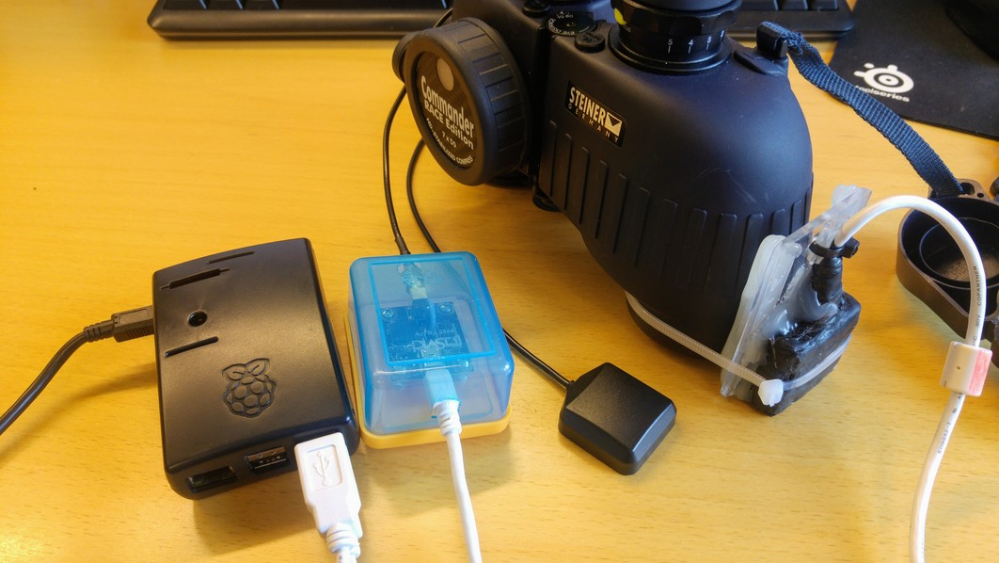

# Developer documentation


## Requirements

There are both hardware and software requirements needed for the Durimeter to work.

### Hardware
1. Raspberry Pi 3
2. [Phidget](https://www.phidgets.com) spatial sensor + GPS (needs two USB 2.0 cables)
3. Something to mount the spatial sensor on (binocular for example?)
4. RTC clock: [DS3231 RTC bord](http://www.dx.com/no/p/ds3231-raspberry-pi-rtc-board-real-time-clock-module-for-arduino-black-277258#.WvVKTdOFPRY) or [DS3231 AT24C32 ZS042](https://www.aliexpress.com/item/DS3231-AT24C32-ZS042-IIC-Module-Precision-RTC-Real-time-Clock-Module-DS3231SN-for-Arduino-Memory-module/32830397657.html?aff_platform=aaf&cpt=1526024967489&sk=Y7bAZbY&aff_trace_key=fde1a24100a143e58db5f059f65f140e-1526024967489-02931-Y7bAZbY&terminal_id=9ffdbd4b8e7e4332824d56f94f47ec2e)

Here is my test hardware setup..



### Getting started

* Install debian packages: `$ apt-get install git gcc python python-dev python-pip espeak`
* Install Driver (See [Phidgets website] (http://www.phidgets.com/docs/Operating_System_Support))
* Create a Python virtualenv
* Within this virtualenv, run:
  * `pip install -r requirements.txt`
* And you're golden


# Dev environment

To speed up development work you are perfectly capable to run the entire MMO server on your local Linux laptop / server, instead of booting up the Raspberry Pi.

Enable the python environment and start the "fake" server that fakes the spatial sensor and GPS:
```bash
source venv/bin/activate
python start_fake.py
```

# Prod environment

When the Raspberry Pi boots it will automatically start the MMO server like this:
```bash
source venv/bin/activate
python start_actual.py
```

# Access web application 

The Rasberry Pi will automatically connect to a WIFI network called mmo with password xxx, see `etc/wpa_supplicant/wpa_supplicant.conf` for configuration settings. 

When developing, it is useful to start a WIFI hot-spot called mmo using you mobile, and also connect your computer to it. The Rasberry Pi should be accessible from IP http://192.168.43.247/.  

# System overview

The architecture is like this:
1. Nginx is the proxy / frontend web server. Functions as a reverse-proxy.
2. Supervisor will start 2 "gunicorn" workers based on the script: `/home/pi/rdi_inclinometer/gunicorn_start`


## Gotchas

* One would assume that the application will stop if running this: `$ sudo supervisorclt mmo stop`, and supervisor echo's to the prompt that the service is indeed stopped. However, the python processes are still running. There is an issue for this bug here: https://github.com/Statoil/rdi_inclinometer/issues/33
* Sometimes the nginx proxy is not capable of accessing the MMO server, so you need to restart nginx using `sudo service nginx restart`.


# Useful resources

- Sensors Info & links to other docs http://www.phidgets.com/products.php?product_id=1044
- Python Excel Library https://openpyxl.readthedocs.org/en/latest/tutorial.html

- Raspberry Pi GPIO Interrupts
    - http://raspi.tv/2013/how-to-use-interrupts-with-python-on-the-raspberry-pi-and-rpi-gpio
    - http://raspi.tv/2013/how-to-use-interrupts-with-python-on-the-raspberry-pi-and-rpi-gpio-part-2

- GPIO Diagram https://learn.adafruit.com/introducing-the-raspberry-pi-model-b-plus-plus-differences-vs-model-b/gpio-port

- GPIO Library (Python)
    - http://sourceforge.net/p/raspberry-gpio-python/wiki/BasicUsage/
    - http://sourceforge.net/p/raspberry-gpio-python/wiki/Inputs/

- Pull-Ups Resistor (Explained) https://learn.sparkfun.com/tutorials/pull-up-resistors

# Authors

- Arve Skogvold <arve@skogvold.org>
- Asbjørn A. Fellinghaug <asbjorn@fellinghaug.com>
