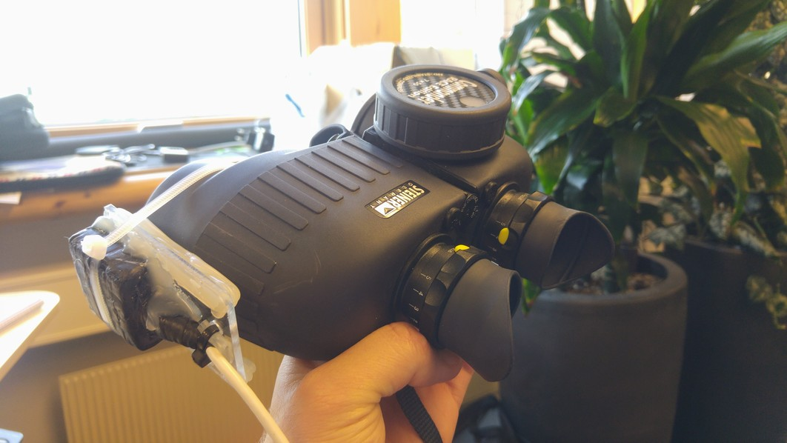

# MMO (Marine Mammal Observatory) introduction

_This is primarily intended for non-developers_

### TDI

Go to the TDI portal and search for "Durimeter - Marine Mammal Observation Assistance Tool" for more information

### Description

_Cost-effective, simple and accurate target ranging device to assist marine mammal observing during seismic operations_

## Example device

Here is a test device where we have mounted the spatial sensor on a binocular. The Raspberry Pi device with GPS is then place in a shoulder bag along with a USB connected battery pack to keep the Raspberry Pi running.

## How to install

You have basically two ways of installing the software after the hardware setup is complete:

1. Download and burn the image file (which is just a dump of the SD card from a the latest working device we have) to the SD card for your Raspberry Pi. *Note* that this will erase everything you have on the target SD card! The image files can be found `G:\TPD\RDI\Arctic_Technolgy\McKeever Temp`. Apply for read access for `Arctic_Technolgy` in [accessit](https://accessit.statoil.no/).

2. Simply checkout the latest source code and follow the instructions mentioned in the [Developer](for_developers.md) documentation.

### Available .img files

* `smartscope-0.1.0.img`
  - Real time clock functionality
  - Delete observations

* `durometer.img`
  - Initial version
  
# User Manual

The user manual can be found [here](http://team.statoil.com/sites/ts-98403/_layouts/DocIdRedir.aspx?ID=5eecd070-807a-4317-a27a-3d111e1f0898&HintUrl=Shared+Documents%2fSMART-SCOPE+Assembly+and+User+Guide+April+2018+Version.docx).

# Contacts

- Jürgen Weissenberger <jurw@statoil.com>
- Tom McKeever <thmc@statoil.com>
